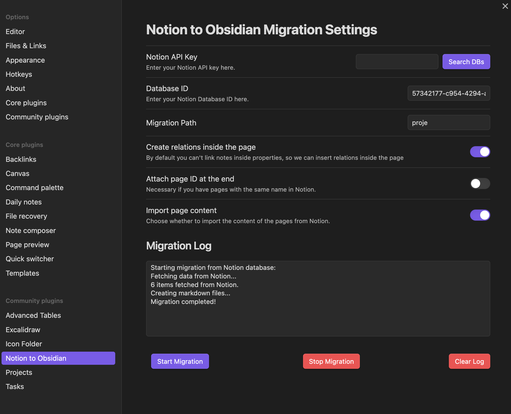

> Coming soon: This  plugin is set to launch shortly!

# Notion Migration Plugin for Obsidian 🚀

## Overview 🌐

The N2O (Notion to Obsidian) allows you to seamlessly migrate your Notion databases into your Obsidian vault.
Say goodbye to the manual labor of copying and pasting your data! 🙌

## Features 🌟

- 🗝️ **Notion API Integration**: Use your Notion API key to connect directly to your Notion workspace.
- 📚 **Database ID Search**: Easily find your Notion database by ID.
- 📂 **Dynamic Folder Suggestions**: As you type the migration path, get real-time folder suggestions.
- 🖋️ **Page Relations**: Choose to insert relations inside the page if your Notion notes have properties that link to other pages.
- 🏷️ **Attach Page ID**: Option to attach Notion page ID to Obsidian note titles, useful if you have pages with the same name. Anyway the plugin will use a sequential number at the end.
- 📄 **Page Content**: Toggle to import the content of the pages from Notion.
- 📝 **Migration Log**: Keep track of your migration progress.

## Installation 🛠️

1. Open Obsidian
2. Go to `Community plugins` in your `Settings`
3. Search for `Notion to Obsidian`
4. Click `Install`

## How to Use 📘

### Notion API Key

First, you'll need go to Notion to get your secret API key and give it permissions for the databases you want import. 

1. **Create API Key** Visit the [Notion Integrations](https://www.notion.so/my-integrations) page and create a new integration.
2. Click `Show Integration` and copy the secret key. This is your Notion API key.
3. **Notion Databases**: For each database you want to import, visit the database page and click `...` menu in the top right corner.
4. Choose `Add Connection` and select the name of the integration you just created.

### Settings Tab

Navigate to the `Notion to Obsidian` settings tab, where you can:

1. **Enter your Notion API Key**: Make sure you've integrated your Notion workspace with the plugin.

2. **Search Notion Databases**: Click the `Search DBs` button to populate a list of databases you can migrate.

3. **Specify the Database ID**: After finding your database, specify its ID. You can just click on any in the list.

4. **Set Migration Path**: First create then choose the Obsidian folder where you want the Notion database to be migrated to.

5. **Set Optional Parameters**:
    - `Create relations inside the page`: To include relations inside the Obsidian note. In this way they won't appear in frontmatter and you can see the connection in the graph.
    - `Attach page ID at the end`: To append Notion's page ID at the end of your Obsidian note.
    - `Import page content`: To import the actual content of your Notion pages into Obsidian.

6. **Start the Migration**: Click `Start Migration`. A migration log will appear showing the progress.

7. **Stop the Migration**: If you need to stop the migration for any reason, click `Stop Migration`.

### Migration Log

You can view the migration log to see the details of what was migrated, any errors, etc. You can also clear the log by clicking `Clear Log`.

## Known Issues ❗

1. Sometimes the migration log won't clear.
2. Not all Notion content is (well) supported.

## Contributing 🤝

Feel free to create an issue or pull request if you find any bugs or have some great feature ideas.

## License 📜

MIT License.

---

🎉 **Happy migrating your Notion databases into Obsidian!** 🎉
